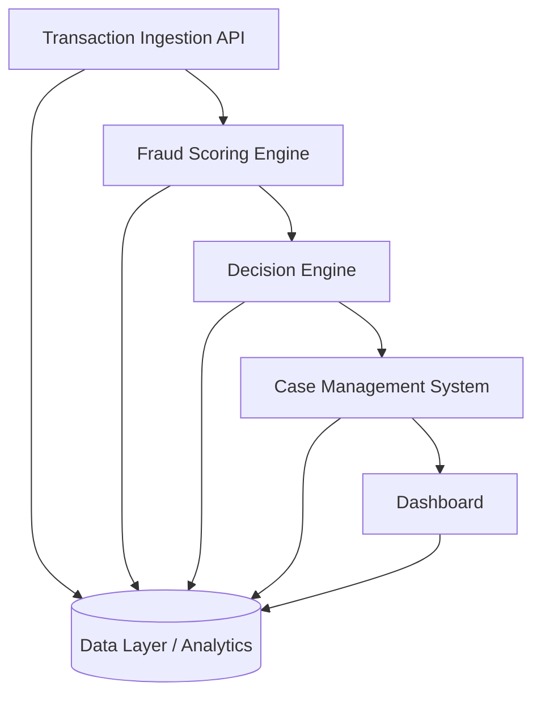

# FraudPulse

FraudPulse is a modular fraud detection platform for card payments that combines machine learning, AI, analytics, and Retrieval-Augmented Generation (RAG) support to help teams detect suspicious activity and act faster.

## Table of Contents

- [1. Overview](#1-overview)
- [2. Live Deployments](#2-live-deployments)
- [3. Architecture](#3-architecture)
- [4. Machine Learning](#4-machine-learning)
- [5. AI Support Assistant](#5-ai-support-assistant)
- [6. Features](#6-features)
  - [6.1 Core Capabilities](#61-core-capabilities)
  - [6.2 Back-office Processing](#62-back-office-processing)
  - [6.3 Investigation System](#63-investigation-system)
- [7. System Architecture](#7-system-architecture)
- [8. Technology Stack](#8-technology-stack)
- [9. Key Repository Structure](#9-key-repository-structure)
- [10. Branch Protection Rules](#10-branch-protection-rules)
- [11. Key Outputs](#11-key-outputs)
- [12. Team](#12-team)
- [13. License](#13-license)

## 1. Overview

FraudPulse is a modular fraud detection system that processes transactions, computes fraud risk scores, and classifies payments into **ALLOW**, **REVIEW**, or **BLOCK**. It is designed as an end-to-end workflow covering ingestion, scoring, decisioning, investigation, and monitoring.

**Supplementary documentation:** [deployed.md](deployed.md) · [design-and-evaluation.md](design-and-evaluation.md) · [ai-tooling.md](ai-tooling.md)

## 2. Live Deployments

- Frontend: [https://fraudpulse-u2va.onrender.com/](https://fraudpulse-u2va.onrender.com/)
- Backend (API docs): [https://fraudpulse.duckdns.org/docs](https://fraudpulse.duckdns.org/docs)
- Backend (health): [https://fraudpulse.duckdns.org/health](https://fraudpulse.duckdns.org/health)

## 3. Architecture

FraudPulse uses a layered architecture with a web client, API services, and fraud intelligence engines, where the **ML fraud engine is the primary decision layer** and the **RAG assistant is a secondary support capability**.

- **Angular frontend**: user dashboards, case views, and support assistant interface
- **FastAPI backend**: fraud APIs, decisioning endpoints, and service orchestration
- **ML fraud detection engine (primary)**: risk scoring, prediction, and fraud classification
- **Analytics services**: trends, metrics, and back-office monitoring
- **RAG-powered AI support assistant**: context retrieval and grounded natural-language responses

```mermaid
flowchart TD
    A[Angular Frontend] --> B[FastAPI Backend]
    B --> C[ML Engine (Primary)]
    B --> D[Analytics Services]
    B --> E[RAG Assistant (Support)]
```

## 4. Machine Learning

FraudPulse’s ML capabilities form the primary fraud intelligence layer for both real-time and back-office fraud operations.

- **Fraud prediction**: estimates probability of fraudulent activity per transaction
- **Risk scoring**: produces normalized fraud scores to support decision thresholds
- **Pattern analysis**: identifies suspicious trends and recurring behavior across events
- **Hybrid decisioning**: combines ML and rules for robust **ALLOW/REVIEW/BLOCK** outcomes

## 5. AI Support Assistant

The AI support assistant is a secondary support layer for product guidance and operational help. It uses RAG to provide context-aware responses and does not replace the core ML-based fraud decisioning pipeline.

- **RAG architecture**: combines context retrieval with LLM generation for grounded answers
- **Knowledge base**: currently uses curated synthetic support content indexed for domain-specific responses
- **Workflow**:
  1. User submits a question
  2. Relevant context is retrieved from the indexed knowledge base
  3. Retrieved context is injected into the LLM prompt
  4. The LLM generates a context-grounded answer

```mermaid
flowchart TD
    Q[User Question] --> R[Retriever]
    K[(Indexed Synthetic Knowledge Base)] --> R
    R --> P[Prompt Builder (Question + Context)]
    P --> L[LLM Response (Grounded Support Answer)]
```

## 6. Features

### 6.1 Core Capabilities

- Real-time transaction ingestion
- Fraud risk scoring
- Rule-based + ML-based detection
- Automated decisioning (**ALLOW / REVIEW / BLOCK**)
- Case creation from alerts

### 6.2 Back-office Processing

- Event reprocessing
- Fraud pattern detection
- Batch evaluation of transactions

### 6.3 Investigation System

- Case lifecycle management
- Alert grouping
- Analyst workflow support

## 7. System Architecture

The complete fraud operations flow includes:

- **Transaction Ingestion API**: receives and validates transactions
- **Fraud Scoring Engine**: computes risk (rules + ML)
- **Decision Engine**: classifies transactions
- **Data Layer**: stores transactions, scores, and cases
- **Back-office Processor**: re-evaluates and detects long-range patterns
- **Case Management System**: supports investigation workflows
- **Dashboard**: monitoring and analytics UI



## 8. Technology Stack

- **Frontend**: Angular
- **Backend**: FastAPI, Python REST services
- **AI/RAG**: retrieval pipeline, vector index, LLM-based response generation
- **Machine Learning**: fraud classification and risk-scoring models
- **Data & Infrastructure**: Supabase, CI/CD with GitHub Actions, containerized services

## 9. Key Repository Structure

```text
.
├── backend/                 -> FastAPI API, ML engine, RAG services, tests
├── frontend/                -> Angular application (UI, routing, feature modules)
├── .github/                 -> CI workflows and project automation
├── ai-tooling.md            -> team AI tooling notes
├── deployed.md              -> deployment guide
├── design-and-evaluation.md -> architecture patterns and testing documentation
├── render.yaml              -> deployment configuration
└── README.md                -> project documentation
```

## 10. Branch Protection Rules

- No direct pushes to `main`
- All changes require Pull Requests
- At least 1 approval required
- CI checks must pass before merge

## 11. Key Outputs

- Fraud risk score (0-1)
- Decision: `ALLOW` / `REVIEW` / `BLOCK`
- Case creation for flagged transactions

## 12. Team

- **Macharia Kibandi** · Project Owner
- **Victor Asena** · Scrum Master
- **Olalekan Erinoso** · Team Member
- **James Kilonzo** · Team Member

For AI-assisted development notes, see [ai-tooling.md](ai-tooling.md).

## 13. License

FraudPulse is licensed under the **MIT License**.

You may use, modify, and distribute the software with minimal restrictions.